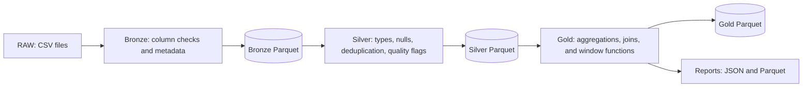

# E-commerce Data Pipeline with PySpark

A local batch pipeline that turns e-commerce CSV files into validated Parquet tables, analytical datasets, and summary reports using a **RAW → Bronze → Silver → Gold** architecture.

This is my first Data Engineering portfolio project. It documents my progress toward a Junior Data Engineer / Junior Big Data Engineer role, with a focus on readable code, data quality, testing, and understanding how Spark executes transformations.

## Project goals

The project brings together skills learned after the basics of DataFrame API, Spark SQL, joins, aggregations, and window functions:

- Organizing a complete pipeline into layers, transformations, validators, and I/O modules.
- Applying data quality rules through JSON configuration.
- Handling nulls and duplicate records with explicit policies.
- Building analytical outputs from multiple related tables.
- Testing both expected results and invalid configurations.
- Understanding lazy evaluation, lineage, actions, and recomputation.
- Evaluating persistence through measurements rather than applying it automatically.

Future portfolio projects will explore more extensive data modeling, orchestration, cloud services, and Databricks. This repository preserves an earlier stage of that learning journey.

## Technology stack

| Component | Purpose |
|---|---|
| Apache Spark / PySpark | Data processing, aggregations, joins, and window functions |
| Python | Pipeline coordination, configuration, logging, and JSON reports |
| Parquet | Storage between layers and for analytical outputs |
| pytest and PySpark testing utilities | Automated tests |
| Docker and Docker Compose | Reproducible local environment |
| JupyterLab | Optional interactive exploration |

The Dockerfile uses `apache/spark:4.2.0-scala2.13-java21-python3-ubuntu`. Python dependencies are installed from `requirements.lock.txt`. The application runs Spark in `local[*]` mode inside one container; Docker Compose does not provision a distributed Spark cluster.

## Architecture



`main.py` checks required files, creates a Spark session, and runs the three layers sequentially. Each layer writes Parquet files that the next layer reads. Gold starts its lineage from the stored Silver data rather than rerunning Silver transformations.

| Layer | Responsibilities |
|---|---|
| RAW | Input CSV files with headers |
| Bronze | Read CSV columns as strings, check required columns and nonempty content, select expected columns, and add `batch_id` and `ingestion_time` |
| Silver | Cast types, handle nulls, deduplicate records, and add business validation flags |
| Gold | Check the expected Silver schema and generate analytical tables and summary metrics |

### Data quality policies

Null handling is configured per table and column. Depending on the rule, a record is dropped, a value is replaced with `unknown` or an empty string, or the missing column is recorded in `missing_values`.

Deduplication uses configured keys and selects records by:

1. The highest number of non-null fields.
2. The most recent `ingestion_time`.
3. Ascending values of the remaining business columns to resolve ties.

The final criterion makes the selection repeatable for conflicting business values; it does not establish which record is factually correct. Rejected duplicate records are returned by the function but are not saved by the current pipeline.

Business validation checks references to other tables, allowed categories, dates in the past, and positive values. It adds individual flags and `business_overall_correct`. Invalid data receives a `False` flag. Missing or unexecutable required rules raise an error. Empty global validation configurations return an empty result, which stops the layer.

**Gold currently includes records regardless of their business validation flags or order status.** Its outputs demonstrate analytical transformations and should not be interpreted as validated financial reporting.

## Dataset

Source: [E-commerce Dataset by abhayayare on Kaggle](https://www.kaggle.com/datasets/abhayayare/e-commerce-dataset).

The downloaded archive contains an `ecommerce_dataset` directory with these files:

| File | Contents | Input records |
|---|---|---:|
| `users.csv` | User profiles, cities, and signup dates | 10,000 |
| `products.csv` | Products, categories, brands, prices, and ratings | 2,000 |
| `orders.csv` | Orders, users, dates, statuses, and amounts | 20,000 |
| `order_items.csv` | Order lines, products, quantities, and amounts | 43,525 |
| `events.csv` | User interactions with products | 80,000 |
| `reviews.csv` | Reviews linked to orders, products, and users | 15,000 |

These are input record counts, excluding headers and before cleaning. The complete RAW files and generated outputs are excluded from Git. Small test inputs and expected results are included under `tests/`.

Download the dataset from Kaggle and place all six CSV files **directly in `data/raw/`**. The project does not include a data generator. Check the source page for the dataset's terms of use; its license has not been independently verified for this repository.

### Local dataset differences

Comparison with the downloaded dataset confirmed matching headers and record counts. The local `events.csv`, `order_items.csv`, and `orders.csv` matched the source byte for byte. The other local files contain these changes:

| File | Local changes relative to the source |
|---|---|
| `products.csv` | Empty `rating` for `P000001`, `category` for `P000002`, and `product_name` for `P000003` |
| `reviews.csv` | Empty `product_id` and `rating` changed from `2` to `3` for `R00000528` |
| `users.csv` | `user_id` changed from `U000003` to `U000001`, introducing a duplicate key |

The original Kaggle files can be used to run the pipeline. They do not contain these local modifications, so outputs may differ from the example report below.

Required file names and columns are defined in `config/input_sources.json`, `config/tables_names.json`, and `config/raw_expected_columns.json`. The three simplified CSV files in `tests/sample_data/` are test fixtures and cannot replace the complete RAW dataset.

## Repository structure

```text
main.py                         # Pipeline entry point
src/
  layers/                       # Bronze, Silver, and Gold coordination
  transformations/              # Bronze metadata and Gold transformations
  validators/                   # Schema, null, duplicate, and business checks
  io/                           # Readers and Parquet / JSON writers
  utils/                        # Paths, configuration, logging, and Spark session
config/                         # JSON schemas and processing rules
tests/
  conftest.py                   # Shared Spark test session
  test_*.py                     # Automated tests
  sample_data/                  # Small input datasets for Gold tests
  expected_data/                # Expected Gold results
data/
  raw/                          # Downloaded input CSV files
  bronze/, silver/, gold/       # Generated layer outputs
  additional_reports/           # Summary history and products by city
logs/                           # Generated pipeline logs
Dockerfile                      # Spark and Python environment
compose.yaml                    # Local container configuration
Makefile                        # Command shortcuts
requirements.in                 # Direct Python dependencies
requirements.lock.txt           # Pinned Python dependencies
```

Silver processing is implemented in the validator modules. Configuration files define type casts, null policies, deduplication keys, business rules, allowed categories, and the Silver schema expected by Gold.

## Getting started

### Prerequisites

- Git.
- Docker with a running daemon and Docker Compose v2.
- Internet access for the initial image build and dataset download.
- Disk space for the container image and generated data.

### 1. Prepare the environment

Clone this repository and open a terminal in its root directory. On Linux, set the user and group IDs used by the container:

```bash
export HOST_UID="$(id -u)"
export HOST_GID="$(id -g)"
```

These values can also be stored in a local `.env` file, which is ignored by Git. The Dockerfile defaults to `1000` for both IDs; the container user needs permission to write to the mounted project directory.

```bash
mkdir -p logs data/raw data/additional_reports
docker compose build
```

### 2. Add the input data

Download and extract the [Kaggle dataset](https://www.kaggle.com/datasets/abhayayare/e-commerce-dataset). Copy `users.csv`, `products.csv`, `orders.csv`, `order_items.csv`, `events.csv`, and `reviews.csv` from the extracted `ecommerce_dataset` directory into `data/raw/`.

A fresh clone does not contain the complete input files. The preflight check stops execution when required files are missing; file presence alone does not guarantee valid contents.

### 3. Run the pipeline

```bash
docker compose run --rm spark-lab python3 main.py
```

Alternatively, use `make build` and `make run-main`.

The project is mounted at `/workspace`, so outputs are available on the host. Each Parquet table is a directory containing `part-*` files. Layer tables and the products-by-city report are overwritten on each run; the JSON report appends an entry to its history.

Inspect pipeline logs with:

```bash
tail -n 50 logs/medallion.log
```

### Optional: JupyterLab

```bash
docker compose up -d
docker compose logs spark-lab
```

Open `http://localhost:8888` using the token shown in the logs. The default service starts JupyterLab; it does not run the pipeline automatically. No exploration notebook is currently included.

Stop the service with:

```bash
docker compose down
```

## Running tests

Tests do not require the complete Kaggle dataset. They use included fixtures and temporary directories.

```bash
docker compose run --rm spark-lab pytest -q
```

Or use `make test`. To run only the Gold transformation tests:

```bash
docker compose run --rm spark-lab pytest tests/test_gold_transformations.py -q
```

The suite covers configuration loading, preflight checks, schemas, null handling, deduplication, business validation, Gold transformations, and report writing. It checks input dictionary preservation, deterministic tie resolution, invalid configurations, JSON history, and Parquet overwrite behavior.

Tests share a Spark session configured with `local[2]`, two shuffle partitions, and UTC. The session is stopped after the suite. Result comparisons do not depend on incidental row ordering. Preflight and report tests use temporary paths rather than writing to pipeline outputs.

**Last verified result: 39 tests passed.**

## Outputs

| Output | Location | Contents |
|---|---|---|
| Sales and revenues | `data/gold/sales_and_revenues/` | Daily amounts, average order value, order counts, rankings, and changes relative to the previous available date |
| Geography | `data/gold/geography/` | Revenue, purchasing user counts, average revenue per user, and city rankings |
| Customer metrics | `data/gold/customer_metrics/` | Amounts and order counts per user, spending segments, and repeat-order flags |
| Products | `data/gold/products/` | Quantities sold, amounts, and product rankings |
| Orders | `data/gold/orders/` | Order amounts and value buckets |
| Customer loyalty | `data/gold/customers_loyalty/` | User metrics attached to order records, intervals between orders, and loyalty rankings |
| Products by city | `data/additional_reports/top_products_per_city/` | Ten products with the highest ordered quantities per city |
| Summary history | `data/additional_reports/report.json` | Summary metrics for successive Gold runs |

### Example summary

An entry from a local run using the modified dataset:

```json
{
  "timestamp": "2026-10-08 17:21:17.467865",
  "share_top_users_in_total_revenue": 33.37,
  "active_users_count": 8635,
  "avg_orders_count_per_user": 2.32,
  "big_orders_share": 60.49
}
```

The JSON file contains a list of these entries. Revenue and order shares are percentages. `active_users_count` counts distinct non-null `user_id` values in orders; it does not represent activity within a defined time window. `big_orders_share` measures orders containing more than one distinct product. Results depend on the input data.

### Example sales results

Expected results from the small Gold test dataset:

| Date | Total amount | Average amount | Orders |
|---|---:|---:|---:|
| 2026-07-01 | 120.00 | 20.00 | 6 |
| 2026-07-02 | 300.00 | 50.00 | 6 |
| 2026-07-03 | 680.00 | 85.00 | 8 |

## Persistence experiment

The intermediate revenue-per-user aggregation is reused for the user count, top-10% revenue share, and geographic output. This made it a candidate for persistence.

I measured the entire Gold layer four times for each variant:

| Variant | Mean Gold execution time |
|---|---:|
| Without `persist()` | 10.25 s |
| With `persist()` | 14.37 s |

Persistence increased the observed mean runtime by approximately 40%, so it was removed. The extracted aggregation function was retained for clarity.

These measurements describe the local dataset and environment, not performance at a larger scale. They cover the whole layer rather than geography alone and were collected before the additional Parquet report was introduced. The lesson was to verify a proposed optimization rather than assume reuse always justifies caching.

## Limitations

- Processing uses full batch loads and table overwrites; incremental ingestion and change data capture are not implemented.
- The project has no Airflow orchestration, database export, cloud deployment, or CI/CD workflow.
- Writes are not transactional across tables. A failed run can leave outputs from different runs together.
- Gold does not filter by business quality flags or order status. Amounts use floating-point types rather than exact financial arithmetic.
- Empty datasets, zero denominators, and casting failures are not comprehensively handled or tested.
- Global ranking windows lack `partitionBy` and have not been optimized for large datasets.
- Scalar metrics trigger separate Spark actions. Only small aggregate results are collected to the driver, but computing them may still scan entire tables.
- Appending a JSON report reads and rewrites the entire history. It is not atomic or safe for concurrent runs.
- Report timestamps use the process's local time without a timezone offset. Reports do not carry a run identifier linked to Bronze metadata.
- Past-date validation depends on execution time. Deduplication uses a technical tie-breaker rather than a source record version.
- The test suite uses small datasets and does not establish end-to-end correctness for every input or scalability.

The intended scope remains a documented first portfolio project. Further work focuses on important fixes and selected tests, while a broader architecture is planned for a separate project.
